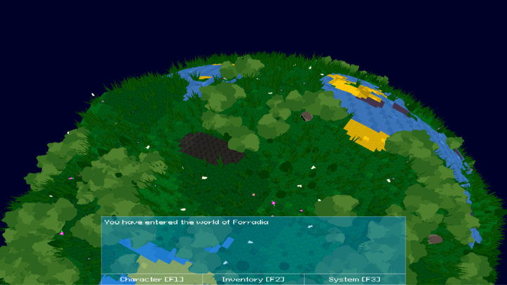
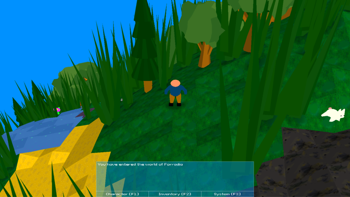

# Forradia
Forradia is a cross-platform sandbox survival/RPG game written in C++ with OpenGL and SDL2.
The engine loads 3D models in Wavefront-format as well as textures and fonts. The maps are tile-based and fully randomly generated.

## Motivation
The purpose of this project is mainly that I use it to improve my knowledge and experience in these technical areas, and eventually find collaborators.

## Build status

## Code style

## Screenshots

## Tech/framework used
**Built with**
* Qt Creator
* CMake

## Features
* Engine allows representation of world map as planets instead of regular flat maps
* Open-source under MIT license
* Cross-platform
* Only dependencies are SDL2-libraries and OpenGL-libraries

## Code Example
**Engine implementation example**

    ObjectsContent.Add("ObjectTree1", DescObjectTree1 );
    ObjectsContent.Add("ObjectTree2", DescObjectTree2 );
    ObjectsContent.Add("ObjectCaveWallBlock", DescCaveWallBlock );

    Scenes.Add("SceneGameStart", MakeUPtr<CSceneGameStart>(Engine));
    Scenes.Add("SceneMainMenu", MakeUPtr<CSceneMainMenu>(Engine));
    Scenes.Add("ScenePrimary", MakeUPtr<CScenePrimary>(Engine));
    
    WorldMap->GenerateWorldMap(DefaultMapGenerator);
    
    StartingInventory.Add(0, "ObjectWoodaxe");
    
    Engine.Run(move(Scenes), GetId("SceneGameStart"), move(WorldMap), StartingInventory, ObjectsContent);

## Installation
### Windows

**Dependencies**  
Download:  
* SDL2 Development Library: [SDL2-devel-2.0.20-VC.zip](https://www.libsdl.org/release/SDL2-devel-2.0.20-VC.zip)  
* SDL2_image Development Library: [SDL2_image-devel-2.0.5-VC.zip](https://www.libsdl.org/projects/SDL_image/release/SDL2_image-devel-2.0.5-VC.zip)  
* SDL2_ttf Development Library: [SDL2_ttf-devel-2.0.18-VC.zip](https://www.libsdl.org/projects/SDL_ttf/release/SDL2_ttf-devel-2.0.18-VC.zip)  
* GLEW Development Library: [glew-2.1.0-win32.zip](https://netix.dl.sourceforge.net/project/glew/glew/2.1.0/glew-2.1.0-win32.zip)  
* Freeglut Development Library: [freeglut-MSVC.zip](https://www.transmissionzero.co.uk/files/software/development/GLUT/freeglut-MSVC.zip)  
  
**Note:**  
The project is configurated to locate headers and libraries in subfolders at C:/, if you change these locations, please change the paths accordingly in *CMakeLists.txt*.

**Run in PowerShell to unpack and relocate the dependencies**  

    tar -xf .\SDL2-devel-2.0.20-VC.zip
    tar -xf .\SDL2_image-devel-2.0.5-VC.zip
    tar -xf .\SDL2_ttf-devel-2.0.18-VC.zip
    tar -xf .\glew-2.1.0-win32.zip
    tar -xf .\freeglut-MSVC-3.0.0-2.mp.zip

    xcopy .\SDL2-2.0.20\include C:\SDL2\include\SDL2 /E /H /C /I /Y
    xcopy .\SDL2_image-2.0.5\include C:\SDL2\include\SDL2 /E /H /C /I /Y
    xcopy .\SDL2_ttf-2.0.18\include C:\SDL2\include\SDL2 /E /H /C /I /Y
    xcopy .\glew-2.1.0\include C:\GLEW\include /E /H /C /I /Y
    xcopy .\freeglut\include C:\freeglut\include /E /H /C /I /Y

    xcopy .\SDL2-2.0.20\lib\x86 C:\SDL2\lib\x86 /E /H /C /I /Y
    xcopy .\SDL2_image-2.0.5\lib\x86 C:\SDL2\lib\x86 /E /H /C /I /Y
    xcopy .\SDL2_ttf-2.0.18\lib\x86 C:\SDL2\lib\x86 /E /H /C /I /Y
    xcopy .\glew-2.1.0\lib\Release\Win32 C:\GLEW\lib\Release\Win32 /E /H /C /I /Y
    xcopy .\freeglut\lib C:\freeglut\lib /E /H /C /I /Y

**Git glone the repo anywhere**

    git clone https://github.com/Eknah/Forradia.git
    cd Forradia

**Build project with CMake and NMake**

    cmake -G "NMake Makefiles" src/game
    nmake

Hopefully everything was successful and you now have a compiled binary.

Move 

### Linux

**Dependencies**

## API Reference
To add

## Tests
To add

## How to use?
To add

## Contribute
To add

## License
MIT